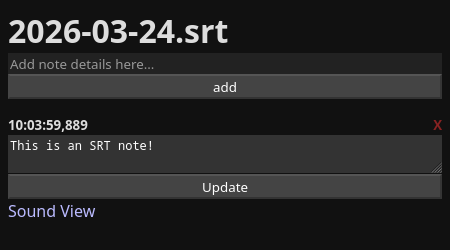
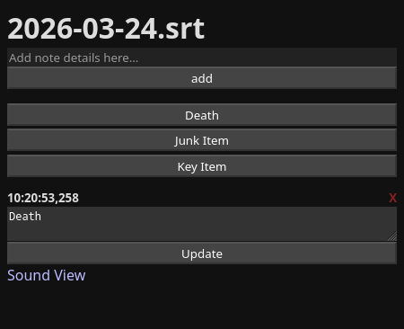

# SRT Notes

Time based note taking that exports notes as SRT subtitle file for integrating into video editing software. Can be embedded in video recording software to create sound alerts for notes to ease editing as well.

*SRT time will be taken from system clock, timecode sync is not supported as OBS does not currently support it either.*

## Install

The only dependancy is [Quart](https://pypi.org/project/Quart/) which can be installed with:

	pip install quart

Quart is used to create the web interface and websocket connections to update clients.

## Basic Usage

SRT Notes is primarily a web server and client pair. You start the web server with `srt-notes.py -w` (omitting the `-w` will allow you to take CLI based notes if desired). Once the web interface is started you can open a browser at the configured location ( [http://127.0.0.1:5000/](http://127.0.0.1:5000/) by default.) From the web interface you can type in a new note and add it. The note will be saved to an SRT file with a timestamp indicating when it was made. Each note entry is sent back to every client do be displayed and an option to update or delete them after if needed is available.

The reason for the web server/client model is to allow multiple clients to be used at once and for integration features. For example, if you are recording video using OBS you can add `/?alarm=1` to the end of the URL (or click the "Sound View" link at the bottom of the page) and embed the note page as a Browser Source. When a new note is is received all clients are updated, alarm clients will also play a sound. You can record the Browser source to an alternate audio track in OBS to create an audio record of when each note was made to make it easier to align the subtitles with the video later. You can also use multiple client devices, like a computer and phone at once to take notes with what is most convenient.

### Filename Selection

You can provide a filename with the `-s` parameter for the SRT file. But as a warning you **MUST** always separate notes by day. SRTs use Timecode for indicating when a title should be shown in a video. Timecode does not support a day or date value, if you append notes to the same file over multiple days *they will be interleaved* and there is **nothing** that can be done to solve this. It is how SRTs work. By default SRT Notes will always use the current date as the filename for the SRT file if you omit the `-s` parameter. It is recommended that you make a folder that you name whatever you need for your project and take notes using the default names inside there.

## Advanced Usage

### URL Submission
Notes may be sent to a URL via an HTTP GET request at the `/add` endpoint using a `text` parameter. For example, with the default settings if you wanted to send a note of "Level beat" via HTTP GET you could open the URL `http://127.0.0.1:5000/add?text=Level%20beat` and it will be added. (Note that some characters made need to be replaced like the space " " with "%20" depending on your web client)

The URL method allows integration with other tools as a way to make it easier to control, for example using "GET request in background" with the [Elgato Stream deck](https://help.elgato.com/hc/en-us/articles/360028234471-Elgato-Stream-Deck-System-Actions-Hotkey-Open-Website-Multimedia#h_01G93JMZXBEAT71H4NSYM2YTXE)

### Text Extraction

This tool actually started out as a simple SRT text extraction tool. This feature still exists and you can specify an SRT file with the `-s` parameter and tell the software to extract and print all text with the `-t` parameter. This can be helpful as an easy way to extract all notes for adapting into a script.

## Shortcuts

If you have some common notes you want to take, you can create a shortcut JSON file that can be loaded with the `-c` parameter as additional buttons underneath the main entry that you can simply click to add new notes. For example, if you are taking notes for editing gameplay footage of a randomizer you may want the following shortcuts for different item types or dying:

	[
		{"text": "Death", "sound": "spikes.wav"},
		{"text": "Junk Item", "sound": "fade-out.wav"},
		{"text": "Key Item", "sound": "phaser.wav"}
	]

This would add three buttons labeled "Death", "Junk Item", and "Key Item" which looks like this:

You'll notice that each shortcut can also have a sound associated with it. Five different sound files are included beep.wav, fade-in.wav, fade-out.wav, phaser.wav, and spikes.wav . These each look visibly different as waveforms in video editing software to make it easier to distinguish one type of note from another. You can add more sounds to the `http/static/sound/` folder if you want to use custom ones.

The different sounds for the shortcuts are activated by any note with text matching a specified shortcut. so in the above example if you manually typed in "Junk Item" it would still play the "fade-out.wav" sound. This allows you to use the URL parameter option to submit shortcut text through alternate means.

### New Shortcut File Tip

If you provide a blank string as a shortcut name it will print a template shortcut that you can use to start a new file. This makes it possible to initialize a new shortcut file with one line:

	srt-notes.py -c "" > shortcuts.json

## Script Help

	$ srt-notes.py -h
	usage: srt-notes [-h] [-s SRT] [-t] [-w] [-i IP] [-p PORT] [-c SHORTCUTS] ...

	Note taking tool for video editing output

	positional arguments:
	message

	options:
	-h, --help            show this help message and exit
	-s SRT, --srt SRT     SRT file for converted data
	-t, --text            Return text from SRT file
	-w, --web             Start web server
	-i IP, --ip IP        Web server listening IP
	-p PORT, --port PORT  Web server listening IP
	-c SHORTCUTS, --shortcuts SHORTCUTS
				JSON file of shortcuts to add

